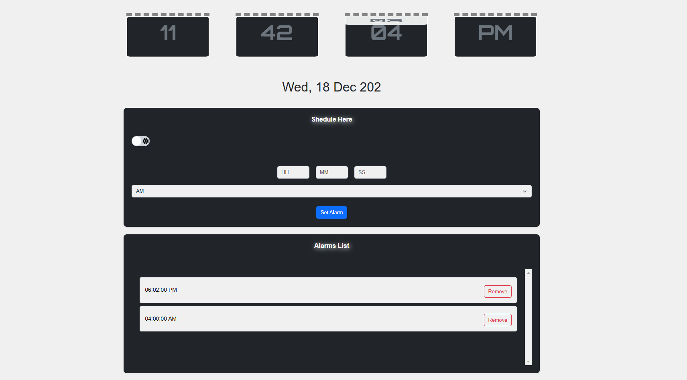

# Alarm Clock

This project is a simple Alarm Clock application built using HTML, CSS, and JavaScript. The application includes a clock that shows the current time, an alarm setting feature, and a list of set alarms. The user can add and delete alarms, with alerts displayed when alarms go off.

## Features

### Clock Face
- Displays the current time with seconds, minutes, and hours updating in real-time.

### Set Alarm
- Provides input boxes to set an alarm (hour, minute, second, AM/PM).
- Allows the user to set an alarm by clicking the "Set Alarm" button.
- Adds the set alarm to the alarms list below.
- When an alarm goes off, it triggers a JavaScript alert in the browser to notify the user.

### Alarms List
- Displays a list of all alarms set by the user.
- Each alarm has a delete button to remove it from the list.
- Deleting an alarm ensures it does not alert the user.

### Adaptive Screen Size
- The application adjusts its layout and design based on the screen size to provide an optimal user experience on both mobile and desktop devices.

### Dark Mode
- Includes a dark mode feature that allows users to switch between light and dark themes for a better viewing experience in different lighting conditions.

## Images

### Preview



## Website

You can view the live project at [Alarm Clock Website](https://hiron1999.github.io/-Alarm-Clock/)

## Usage

1. **Clone the Repository**
   ```sh
   git clone https://github.com/your-username/alarm-clock.git
   cd alarm-clock
